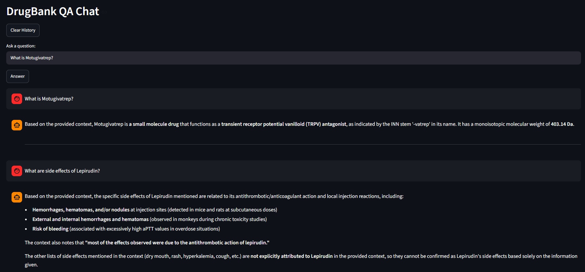

# 💊 DrugBank QA Chatbot (RAG + Claude Sonnet)

A Retrieval-Augmented Generation (RAG) chatbot that answers biomedical questions using the DrugBank dataset.  
It retrieves relevant scientific context using **ChromaDB** and generates grounded answers using **Claude Sonnet**.

---

## 🚀 Live Demo

👉 https://drugbank-chatbot.streamlit.app  

---

## 📸 Preview

---

## 🧠 Key Features

- RAG pipeline with semantic retrieval (ChromaDB)
- Claude Sonnet for context-aware answers
- Cached dataset loading for fast startup
- Persistent vector database
- Streamlit chat interface

---

## ⚙️ Tech Stack

- Python
- Streamlit
- ChromaDB
- Anthropic Claude API
- Hugging Face Datasets
- Sentence Transformers
- Pydantic

---

## 🏗️ How It Works

1. Loads DrugBank dataset (cached locally)
2. Splits documents into chunks
3. Stores embeddings in ChromaDB
4. Retrieves relevant context per query
5. Generates grounded answer using Claude Sonnet

---

## 💡 Why This Project Matters

This project demonstrates:
- End-to-end RAG system design
- Vector database usage
- LLM integration (Claude)
- Real-world NLP pipeline engineering
- Deployment of AI applications

---